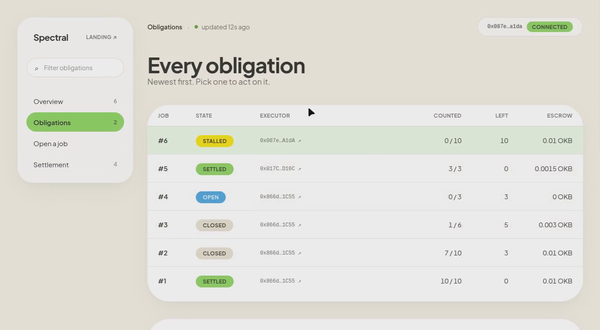
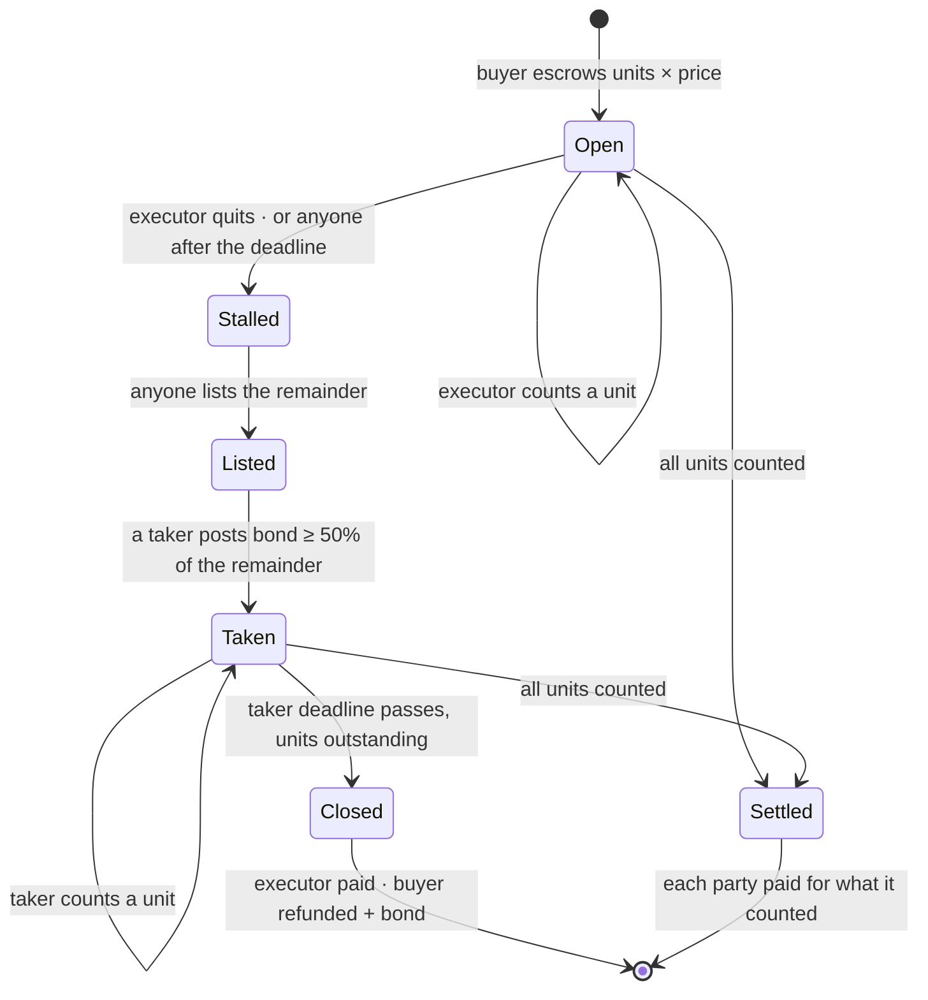
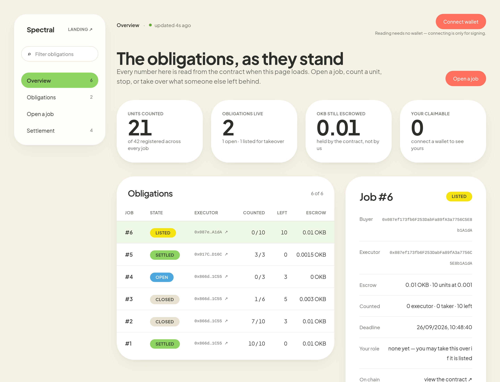
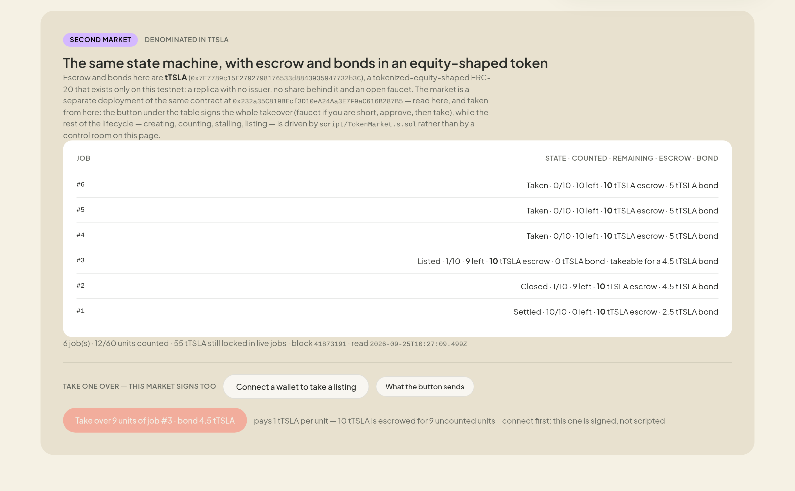
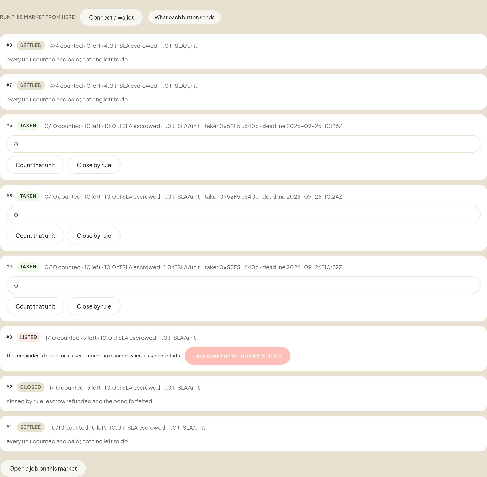
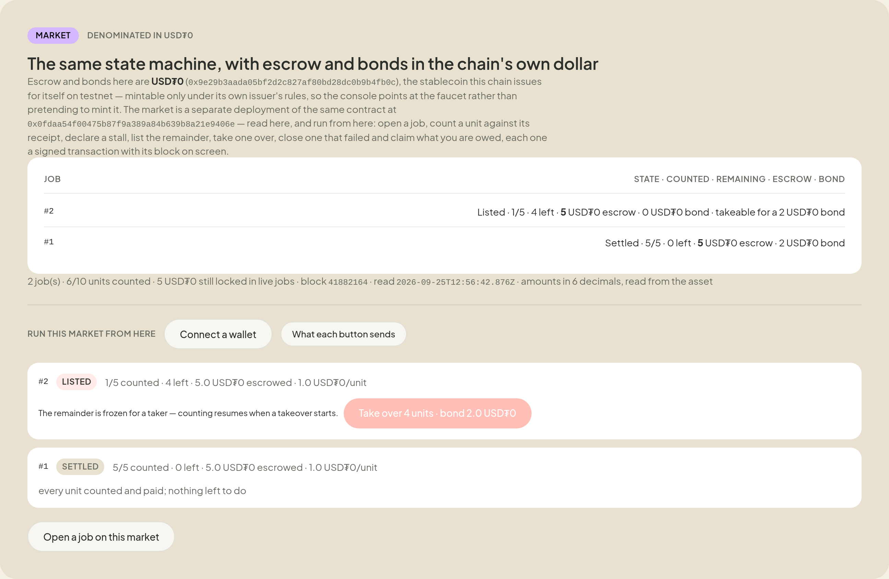
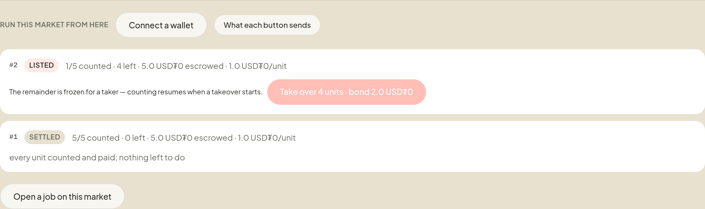
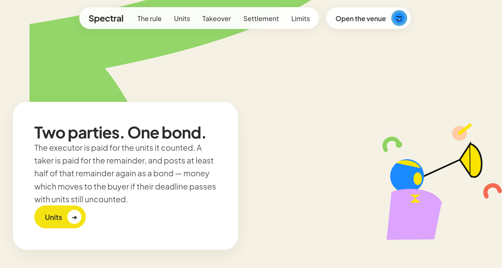
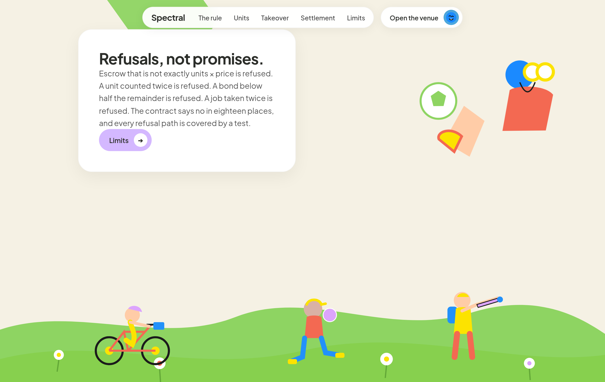

<div align="center">

# SPECTRAL

### Unfinished machine work, turned into a counted obligation. Stop mid-job and the remainder is listed, bonded, and settled by arithmetic.

[](#tests)
[](#source-verification)
[](#take-a-live-obligation-yourself)
[](#live-status)
[](#attack--test)
[](LICENSE)


[](https://youtu.be/EK-t91r63Fw) [](demo/media/spectral-demo.mp4) [](https://spectral-venue.vercel.app) [](#whats-real-vs-pending--the-honesty-table) [](#-see-it-in-one-command)

</div>

Most work systems answer the easy question: _is the job done?_ SPECTRAL answers the harder one: **who is owed what when it stops halfway?** Today an agent that stalls mid-job leaves two options: a full refund, or an argument. The work already finished has no representation at all, so it is thrown away. SPECTRAL makes the remainder a first-class object: it is counted, listed, priced by whoever takes it, bonded, and settled by the count of finished units. Nobody votes, nobody arbitrates, and no key exists that can move the money.

```
UNFINISHED  ≠  FAILED  ≠  REFUNDED
```

There is no `PARTIALLY_DONE_WITH_WARNINGS`. Either the executor counted the units and is paid for them, or the remaining units are still locked in a live job. Every wei is in exactly one of those two places, in every terminal path, and that is asserted by a fuzzed invariant rather than promised in prose.

## Live status

**Built for OKX Dev Day 2026 — Build a Market, remote build.** The chain is OKX's **X Layer testnet 1952** (chain id `0x7a0`, OKB for gas); every receipt opens in **OKX's own explorer**, and the venue reads that chain in a browser with no wallet installed. Exactly how much of the build sits on OKX's own surface is listed under [On OKX and X Layer](#on-okx-and-x-layer) — stated, not implied.

**Deployed and exercised on a public testnet**, with no owner, no admin, no oracle, no jury, and no upgrade path. `verify.py` ignores our records entirely and re-derives the claims from the chain: it asks the contract how many jobs it holds, then prints **26/26** across all six of them without being told which to look at. The venue is live at **https://spectral-venue.vercel.app** and reads that same contract from the browser with no wallet installed.

| Surface | Status | The evidence |
|---|---|---|
| Contract, testnet 1952 | **LIVE** | `0x2899eb0972f86cc90d054d19a5816233d9af56d9` — six jobs, lifecycle run end to end, `verify.py` **26/26** |
| Job #1 | **SETTLED** | the executor counted 4 of 10 and stopped; a taker took the remainder, counted the other 6, and the job settled 10/10 — each side paid for exactly what it counted |
| Job #2 | **CLOSED** | 7 of 10 counted (4 executor, 3 taker); the 3 remaining units and the forfeited bond went back to the buyer by rule |
| Job #3 | **CLOSED** | a taker posted a bond, counted nothing, and was owed nothing — the bond moved to the buyer |
| Job #4 | **OPEN** | a live job, escrow still locked, nothing owed to anyone yet |
| Job #5 | **SETTLED** | one address as buyer, executor and taker walked the whole path: 3 of 3 counted, 0.002 OKB credited to that address, and `requiredBond(5)` read back from the contract |
| Job #6 | **LISTED — takeable now** | ten units escrowed at 0.001 OKB, nothing counted; listed with a taker deadline of 2026-09-26 10:04 UTC, so the contract asks a **0.005 OKB bond** from anyone who wants the remainder — take it from any wallet, see [Take a live obligation yourself](#take-a-live-obligation-yourself) |
| Seven invalid actions | **REFUSED by the deployed bytecode** | `UnitAlreadyCounted`, `EmptyReceipt`, `UnitOutOfRange`, `NotExecutor`, `NothingToTake`, `AlreadyStalled`, and an arithmetic panic — each with the contract's own reason, in [docs/LIVE-GATES.md](docs/LIVE-GATES.md) |
| Venue application | **LIVE** | landing at `/`, venue at `/app`; reads six jobs and 21 of 42 counted units off the contract in a browser, anonymous, 0px overflow |
| Board API, keyless | **LIVE** | `GET /api/board` returns the same six jobs, 21/42 units and 0.01 OKB still locked, read from the contract at request time; `?job=` and `?state=` filter it, `?market=token` reads the equity-shaped market and `?market=usd` the dollar one; `GET /api/config` lists all three, so no surface advertises a market another one has not heard of |
| Token-denominated market, testnet 1952 | **LIVE** | `0x232a35C819BEcf3D10eA24Aa3E7F9aC616B287B5`, escrow and bonds in `tTSLA`; **eight jobs and five takeovers** on it, every takeover signed from the venue page — one of them by a wallet that held none of the token when it started — and two jobs carried all the way to **settlement and claim** the same way; `verify_token.py` **45/45**, receipts and hashes in [docs/TOKEN-MARKET.md](docs/TOKEN-MARKET.md) |
| The equity-shaped token it escrows | **LIVE, and a replica** | `0x7E7789c15E2792798176533d8843935947732b3C` — a real ERC-20 deployed on this testnet, open faucet, no issuer and no share behind it; the app calls it a replica everywhere it appears |
| Dollar-denominated market, testnet 1952 | **LIVE** | `0x0fdaa54F00475b87f9A389a84b639B8a21e9406e`, escrow and bonds in a **6-decimal token this build did not deploy** — the chain's own testnet dollar, obtained from the faucet the way anyone else would obtain it. One job **settled 5/5 through the page** (thirteen transactions, one wallet, nonces 28–40) and one **listed and takeable**; hashes in [the third market](#the-third-market--escrowed-in-a-token-this-build-did-not-deploy) |
| Three live listings, one per market | **LISTED, takeable by anyone** | native job #6: 10 units at 0.001 OKB, **0.005 OKB bond**, deadline 2026-09-26 10:04 UTC · token job #3: 9 units remaining at 1 tTSLA, **4.5 tTSLA bond**, deadline 2026-09-26 10:05 UTC · dollar job #2: 4 units remaining at 1.000000 each, **2.000000 bond**. `?state=Listed` on any board returns them. No listing has yet been taken by a wallet outside this build — the takeovers that *have* been signed came from wallets this build generated, every one from the page — and taking one is what [Take a live obligation yourself](#take-a-live-obligation-yourself) is for |
| Source verification | **DONE — 4/4 on Sourcify** | all four deployed contracts rebuilt from `src/` and matched: `Spectral` `match` (ID 52236721), `SpectralToken` `exact_match` (ID 52236800), `TestnetEquity` `exact_match` (ID 52236822), the dollar market `exact_match` (ID 52289156). `verify_source.py` re-checks it keylessly; [docs/SOURCE-VERIFICATION.md](docs/SOURCE-VERIFICATION.md) has the levels and commands |
| Source verification on OKX's explorer | **NOT ATTEMPTED** | that route is gated behind a paid plan and no such credential exists here; the explorer shows the contracts unverified. Stated rather than left to be discovered — the rebuild above is the evidence |
| Someone outside this build taking over an obligation | **NOT YET** | stated plainly in the [honesty table](#whats-real-vs-pending--the-honesty-table) rather than implied |

## On OKX and X Layer

The build sits on OKX's chain. This section says exactly how much of it is on OKX's own surface — no more than is true.

| Piece | What it is | Where |
|---|---|---|
| Chain | **X Layer testnet 1952** (chain id `0x7a0`), gas token **OKB** | `app/app/api/config/route.js` serves every chain value at runtime from the environment; no chain id, RPC, explorer or address is compiled into the client |
| RPC | X Layer's public testnet RPC (`testrpc.xlayer.tech/terigon`) — the same endpoint `verify.py` re-derives the claims from | `verify.py`, `foundry.toml` |
| Explorer | every receipt opens on **OKX's explorer** (`okx.com/web3/explorer/xlayer-test`), and the venue renders a per-row explorer link for each job | `docs/RECEIPTS.md`, `docs/LIVE-GATES.md`, `app/components/Dashboard.jsx` |
| Faucet | where a judge needs gas to sign, the app links **OKX's X Layer faucet** | `app/components/Dashboard.jsx` |
| Wallet | signing is EIP-1193, and **OKX Wallet is selected first when the extension is installed** (`window.okxwallet`), then any other injected wallet | `app/lib/wallet.js` |
| Chain add / switch | the wallet is offered X Layer's chain id, name, native currency, RPC and explorer via `wallet_addEthereumChain`, so first-time signers are not left configuring a network by hand | `app/lib/venue.js` |

What is **not** wired, said plainly rather than implied: no OKX.AI agent or ASP listing, no x402 payment path, no OKX DEX or market-data call on the critical path, and no mainnet deployment. `.env.example` reserves `OKX_API_KEY` for server-side market data; nothing the product runs depends on it. Testnet is a deliberate choice for a mechanism this young, and the contract is chain-agnostic — no precompiles, no oracles, no token interfaces — so mainnet is a redeploy rather than a rewrite. [How I'd deploy it](#how-id-deploy-it) says what would change.

## This is a market, in market words

Built for the **Build a Market** track, so here is the same mechanism said in market vocabulary rather than protocol vocabulary. Every row maps to something the contract does and to the test that covers it.

| What a market needs | What this one does | Enforced by |
|---|---|---|
| Supply anyone can see | a stalled job's remainder becomes a listing: `listObligation(jobId, takerDeadline)` is permissionless, and the board renders every listing to a visitor with no wallet | `test_matrix_*`, the venue's anonymous read |
| A price | fixed when the job is funded — `createJob` requires exactly `units × pricePerUnit`, and the remainder inherits that same per-unit price, so the buyer's exposure cannot move afterwards | `testCreateRequiresExactEscrow`, `test_escrow_one_wei_short_refused` |
| A buyer for the remainder | anyone may take a listing by posting a bond at or above the contract's own `requiredBond(jobId)` — no allowlist, no approval step | `test_bond_formula_*`, `BondTooSmall(required)` |
| Collateral that makes failing expensive | the bond is at least half the remaining escrow and forfeits to the buyer if the taker's deadline passes with units uncounted; a taker who finishes gets it back in full | `testTakerFailureForfeitsBondToBuyer`, `closeFailed` |
| Settlement, not arbitration | each party is paid `units counted × pricePerUnit`; there is no `resolve()`, no jury, and no key that can call one | `testFuzzConservation` (256 runs) |
| A read surface other software can consume | the listing board is a public keyless JSON API, and a CLI that speaks the same module — see [below](#read-the-market-from-anywhere--the-board-api) | `GET /api/board`, `scripts/board-cli.mjs` |

Two things this market prices differently from a conventional one, said plainly. **The bond is where risk is priced, not the price itself** — per-unit price is fixed at funding and only the bond responds to how much remainder is at stake, so a taker's expected return is the gap between the remaining escrow and what finishing actually costs it. And **there is no reputation input**: a taker is judged today by its bond, not its history, which is the deliberate trade this design makes — arithmetic instead of a trusted judge. [Limitations](#limitations) says where that bites.

What this market deliberately does not have: a fee, a token, a curator, a council, or a dispute window.

## The second market — escrowed in a token that is shaped like an equity

The market above escrows **native value**, and native value cannot be a share. The things a market on OKX's rail actually trades are tokenized equities and stablecoins, so on a testnet the honest move is not to simulate a token but to **deploy one and use it**.

So the same contract is deployed a second time with an ERC-20 as its asset: **`SpectralToken`**, at `0x232a35C819BEcf3D10eA24Aa3E7F9aC616B287B5`, escrowing **`tTSLA`** at `0x7E7789c15E2792798176533d8843935947732b3C`.

Being precise about the token, because this is the one place a project could flatter itself: it **is** a real ERC-20 on X Layer testnet — deployed by this project, with real transfers, balances and allowances, and an open `mint()` faucet so anyone can obtain it. It is **not** an xStock, not Backed-issued, not a Tesla share, not a claim on anything. It has no issuer, no transfer agent, no redemption and no price. The name it returns is `Testnet Equity Replica: TSLA`, and the app calls it a replica wherever it appears. What it gives the market is what the market needs: a token that behaves like the asset it stands in for.

The state machine is identical — the same counting, the same single-count-per-index rule, the same stall, listing, bonded takeover and forfeit, the same arithmetic settlement in place of arbitration, and still no owner, admin, oracle, jury, pause or upgrade path. Two things differ, both visible in the source:

| | native-value market | token-denominated market |
|---|---|---|
| escrow and bond move by | `msg.value` | `transferFrom`, so an allowance must cover it |
| taking an obligation | payable bond | `takeObligation(jobId, bondAmount)` |
| the asset | the chain's native coin | fixed at deployment, `immutable` — it can never be repointed |

**Eight jobs have been run on the live testnet in this token** — and **twenty-two of those transactions were signed by one wallet clicking buttons on the venue page**, not by a script. The listing that is open right now can be taken the same way:

- **Job 1** — 10 tTSLA escrowed. The executor counted 5 units and stalled. A different wallet took the remainder for the 2.5 tTSLA bond the contract asked for, finished the five remaining units, and it settled by arithmetic: 5 tTSLA to the executor, 5 tTSLA plus the returned bond to the taker.
- **Job 2** — the taker bought a nine-unit remainder for a 4.5 tTSLA bond and finished nothing. After the deadline the close moved the money by rule: 1 tTSLA to the executor for the unit it counted, 9 tTSLA of unearned escrow back to the buyer, and the 4.5 tTSLA bond forfeited to that same buyer. The market held 14.5 tTSLA before and 0 after.
- **Jobs 3 to 6** — listing and takeover under load. Job 3 is the one **still listed**, nine units takeable for a 4.5 tTSLA bond. Jobs 4, 5 and 6 were each taken by a wallet that had **never held the token**: it minted the shortfall from the replica's open faucet, approved the market for the bond, and took the listing — three contract calls each, signed from the venue page itself, twice against a local build and once against the production URL.
- **Jobs 7 and 8** — the whole lifecycle from the page. One job was opened from the console, counted, stalled, listed, taken, counted out, settled and **claimed**; the other went the same way in a single run. Fourteen transactions, every one signed by the page and every hash recovered back **from the chain** rather than from the run's own log, which is what [docs/TOKEN-MARKET.md](docs/TOKEN-MARKET.md) tabulates with their blocks.

```bash
$ RPC_URL=https://testrpc.xlayer.tech/terigon \
  VENUE=0x232a35C819BEcf3D10eA24Aa3E7F9aC616B287B5 python3 verify_token.py
no JOBS given: reading all 8 job(s) the contract holds

  [PASS] the market holds exactly what it owes, in the asset it names —
         55000000000000000000 held == 0 credits + 55000000000000000000 in flight,
         across 6 participant(s) named by the jobs

45/45 verified
```

And the same script over the dollar market, which escrows a token this build did not deploy:

```bash
$ RPC_URL=https://testrpc.xlayer.tech/terigon \
  VENUE=0x0fdaa54f00475b87f9a389a84b639b8a21e9406e python3 verify_token.py
no JOBS given: reading all 2 job(s) the contract holds

  [PASS] the market holds exactly what it owes, in the asset it names —
         5000000 held == 0 credits + 5000000 in flight, across 2 participant(s)

15/15 verified
```

No job list: the script asks the contract how many jobs it holds and checks all of them. An explicit `JOBS=...` list still works, and if that list omits jobs the market also holds, the conservation check now says so out loud instead of reporting a failure that isn't one.

`verify_token.py` reads the market and the token it names, keyless: escrow arithmetic per job, counted units never above registered units, the bond never below half the remainder, states inside the six the contract defines, **the market's token balance equal to its credits plus what is still in flight**, no native value held at all (this contract has no payable path), and the token supply a plain faucet mint. Every hash — deploys, five takeovers, the failed close, every claim — is in [docs/TOKEN-MARKET.md](docs/TOKEN-MARKET.md), and [the venue page](https://spectral-venue.vercel.app/app#second-market) renders this market **and runs it**: the table is server-rendered from the same public reader (so the numbers are in the HTML before any JavaScript runs), and the control room under it signs every call of the lifecycle — open a job, count a unit against its receipt, declare the stall, list the remainder, take one over, close one that failed, claim what you are owed — each confirmed with its block and an explorer link.

What this buys, said without inflation: it shows the mechanism is **not tied to native value**. The invariants, the test suite, the fuzz and the verifier are the same because the machine is the same; only the asset moved. What it does not buy is a claim to be trading an equity — the equity is a replica with no issuer and no share behind it, and the app says so on the panel. What the second market does buy is a market with a **second exit and a second control room**: every call of its lifecycle — open a job, count a unit against its receipt, declare the stall, list the remainder, take it over, close one that failed, claim what you are owed — is signed from the page against real balances and real allowances, and each one shows the block it landed in. The scripts still drive the same calls for scripted runs; the page is what a visitor uses.

## The third market — escrowed in a token this build did not deploy

Same contract. One difference, and the difference is the point: **the asset already existed**, and
this build could only obtain it the way anyone else can — from the chain's faucet.

| | |
|---|---|
| market | `0x0fdaa54F00475b87f9A389a84b639B8a21e9406e` — Sourcify `exact_match`, match ID **52289156** |
| asset | `0x9e29b3AaDa05Bf2D2c827Af80Bd28Dc0b9b4FB0c` — the chain's own testnet dollar, `decimals()` **6**, no issuer of ours. The 10.000000 this build holds arrived in one transfer at block `41879883` from `0xf6d08812…`, the faucet |
| job #1 | **settled 5/5 — thirteen transactions signed from the venue page by one wallet**, nonces 28–40, blocks 41881109–41881551 |
| job #2 | **listed — 4 of its 5 units takeable for a 2.000000 bond**, at 1.000000 per unit |

Job #1, every step named by its own selector (`cast 4byte` on the hash, not by our label for it):

| step | transaction | block |
|---|---|---|
| approve the escrow | `0x38e0f476e5bef314992354358d86b3fd150ff9dafddc79afbf50834b0bd55cc3` | 41881109 |
| `createJob` — 5 units at 1.000000 each | `0x2f68fb60f5799d3cc528524ece083170e42edc3039fe645218d4db69e993d1dd` | 41881111 |
| `countUnit(0)` | `0xbb60c5c676173525f6b245d243b2e4d3ffc7c3f6c25d86ecbfaa2dd1ef395d61` | 41881280 |
| `declareStalled` | `0x7f7bd15ee7425b90b96fd620341cd6878065969d981f63eafe36d3e64d1dafee` | 41881287 |
| `listObligation` — the remainder becomes takeable | `0xb45d02407386732e9bd7aad1cacddfc99d22f5a2068f396d799c1f59c3b4eb49` | 41881311 |
| approve the bond | `0xfeb1ad67af72953fce3d5e7240f1b465854c4ce73ac93ec8df95fceb9386966a` | 41881340 |
| **`takeObligation` — the takeover** | `0x064f294c9c16a17d5d9f22b81ed4bfcf1d5fb80718334fed7f1bb5693797c673` | 41881343 |
| `countUnit(1)` | `0x1cd823386a530fe2999d0f51cc263b57bfe206ea1e047a0fa84c48122426d5c4` | 41881367 |
| `countUnit(2)` | `0x832906e30de8b8c6276d810ee725ca76e7326278999bf554837b1b69164e38ed` | 41881379 |
| `countUnit(3)` | `0x4b8560eab290e08c7d7e9a6e885edbad1ec663025f20ef5cc6f45033415e253a` | 41881514 |
| `countUnit(4)` | `0x64cd42a1255c6db24d5e2e123cb0ccdcd18778cc4926051dd3656a3ec1c903d8` | 41881531 |
| `claim()` | `0xa493995a600d883458109ef5d91c560c6b0a65e7d83072bccbf9db1b4dc86198` | 41881551 |

(Two of the thirteen are approvals: the take's bond needs one, and the page issued a second because
its read of the standing allowance was one beat stale. Both are in the receipts.)

Job #2's five, all from a second wallet that also holds the dollar — `approve` `0x168550d9…` 41882072,
`createJob` `0xce96bd0a…` 41882077, `countUnit(0)` `0x9d97cc1e…` 41882094, `declareStalled` `0xe5e6fac7…` 41882148,
`listObligation` `0xab62188c…` 41882160 — and then that wallet stopped, which is why the remainder is
still sitting there for anyone to take.

**What this market buys.** The first two escrow assets this build deployed, so a reader is entitled
to ask whether the mechanism would survive contact with a token it does not control. This one is that
test, run for real: an outside ERC-20, obtained from the faucet, escrowed, counted against receipts,
stalled, listed, taken over, settled and claimed. Nothing was mocked and no privileged path exists —
the market's only powers over the asset are `transferFrom` against an allowance and `transfer` back.

It is also where the decimals rule finally has teeth. Every amount on screen is converted with the
**asset's own `decimals()`**, read from the token rather than assumed. This asset answers `6`, so
five dollars of it reads `5 USD₮0`. Read with the eighteen-decimal assumption the first two markets
were deployed with, the same raw integer would read `0.000000000005` — wrong by a factor of a
trillion, not by a rounding error. That rule was written into the first market; this is the asset
that shows what it is for. (Amounts are trimmed for reading; the raw integer is always in the board
API's JSON beside every amount, so nothing is rounded away.)

No third market will be claimed as a fourth thing to maintain: it is a configuration entry.
`lib/market-config.js` reads the markets a deployment serves out of the environment, so adding one is
a change to the environment rather than a change to the code — which is exactly how this one arrived.

## ▶ Demo

[](https://youtu.be/EK-t91r63Fw)

**[▶ Watch the demo (2:15)](https://youtu.be/EK-t91r63Fw)** &nbsp;·&nbsp; **[ Local copy ↗ ](demo/media/spectral-demo.mp4)** &nbsp;·&nbsp; **[ What's real vs pending ↗ ](#whats-real-vs-pending--the-honesty-table)** &nbsp;·&nbsp; **[ Run it yourself ↗ ](#-see-it-in-one-command)**

_One take of the deployed venue, driven from the page with a real wallet against X Layer testnet._ The narration is deliberately sparse: it stays quiet through both wallet signatures, so what you hear about is the on-chain result rather than the clicking.

The walkthrough opens the board with all six obligations and their states, opens a new job for ten units, signs the escrow, and then reads that escrow back off the explorer: accepted, 0.01 OKB, block 41,854,761. It stalls the job at the end, which is why the board it closes on shows job #6 sitting live with nothing counted. That is the state the whole mechanism exists for: work that stopped, still on the books, with a price on the remainder instead of a refund. That job has since been **listed** — which is the state [the screenshot above](#screenshots) shows, and the reason anyone can now take it.

Both of job #6's transactions are openable: `createJob` and `declareStalled`, in [docs/RECEIPTS.md](docs/RECEIPTS.md).

## The 20-second pitch

An agent is hired for ten units of work and stops after seven. Under a refund rule the buyer gets everything back and the seven finished units are thrown away. Under a dispute the money sits with a third party while a human reads a ticket. Both outcomes punish the party that did the work.

SPECTRAL prices the remainder instead. The executor declares the stall, or anyone can once the work deadline passes, and the three unfinished units become a listed obligation. A taker puts up a bond of at least half the remaining escrow to claim them. If the taker finishes, the executor is paid for seven and the taker for three plus its bond back. If the taker never finishes, the executor is still paid for seven, the buyer is refunded the remainder, **and the buyer keeps the bond**. That last sentence is the whole design: failing to finish costs the taker money, the party that worked is paid either way, and no administrator decides any of it.



## Table of contents

- [Live status](#live-status)
- [On OKX and X Layer](#on-okx-and-x-layer)
- [▶ Demo](#-demo)
- [The 20-second pitch](#the-20-second-pitch)
- [This is a market, in market words](#this-is-a-market-in-market-words)
- [The second market — escrowed in a token that is shaped like an equity](#the-second-market--escrowed-in-a-token-that-is-shaped-like-an-equity)
- [The third market — escrowed in a token this build did not deploy](#the-third-market--escrowed-in-a-token-this-build-did-not-deploy)
- [Table of contents](#table-of-contents)
- [▶ See it in one command](#-see-it-in-one-command)
- [Screenshots](#screenshots)
- [Verify every claim in one command](#verify-every-claim-in-one-command)
- [Source verification](#source-verification)
- [What SPECTRAL is NOT](#what-spectral-is-not)
- [The problem I set out to solve](#the-problem-i-set-out-to-solve)
- [What I built](#what-i-built)
- [Architecture](#architecture)
- [The continuation loop, step by step](#the-continuation-loop-step-by-step)
- [Where the guarantee is enforced](#where-the-guarantee-is-enforced)
- [Who approves what](#who-approves-what)
- [Engineering decisions & the traps that taught me something](#engineering-decisions--the-traps-that-taught-me-something)
- [What's real vs pending — the honesty table](#whats-real-vs-pending--the-honesty-table)
- [Attack → test](#attack--test)
- [The app](#the-app)
- [Read the market from anywhere — the board API](#read-the-market-from-anywhere--the-board-api)
- [Take a live obligation yourself](#take-a-live-obligation-yourself)
- [Limitations](#limitations)
- [Security](#security)
- [Tech stack](#tech-stack)
- [Project layout](#project-layout)
- [Full command reference](#full-command-reference)
- [How I'd deploy it](#how-id-deploy-it)
- [Results and supporting records](#results-and-supporting-records)
- [Tests](#tests)
- [License](#license)

## ▶ See it in one command

Requirements: `forge` 1.x (Foundry), and Node 20+ only if you want the venue app. **`lib/forge-std` is vendored in this repository**, so a fresh clone runs the whole suite with no install step — `git clone` then `forge test`.

```bash
$ forge test
Suite result: ok. 25 passed; 0 failed; 0 skipped
Suite result: ok. 235 passed; 0 failed; 0 skipped
Suite result: ok. 28 passed; 0 failed; 0 skipped

Ran 4 test suites: 288 tests passed, 0 failed, 0 skipped (288 total tests)
```

```bash
$ RPC_URL=https://testrpc.xlayer.tech/terigon \
  VENUE=0x2899eb0972f86cc90d054d19a5816233d9af56d9 JOBS=1,2 python3 verify.py
  [PASS] escrow is exact: 10 units × 1e18 == 10e18, read from the deployment
  [PASS] counted units never exceed total units, for every job
  [PASS] a settled job paid out exactly its escrow
  [PASS] venue holds exactly what it owes: credits plus money still in flight
  ...

10/10 verified
```

The whole verification is one command with no credentials, no key, and no file of ours trusted: `verify.py` talks to the chain directly and re-derives each claim, including the one that matters most: that the venue holds exactly what it owes, with money still locked in live jobs counted as in-flight rather than assumed spent.

And the other question a reader cannot answer by reading — whether the deployed bytecode is the code in `src/` — answered by a rebuild, not by a promise:

```bash
$ python3 verify_source.py

  Spectral       0x2899EB0972F86cC90d054d19a5816233d9Af56D9  match
  SpectralToken  0x232a35C819BEcf3D10eA24Aa3E7F9aC616B287B5  exact_match
  TestnetEquity  0x7E7789c15E2792798176533d8843935947732b3C  exact_match
  SpectralToken (USD) 0x0fdaa54f00475b87f9a389a84b639b8a21e9406e  exact_match

4/4 deployed contracts rebuilt from source and matched
```

Sourcify rebuilds the sources in this repository and compares them against the deployed bytecode, creation and runtime separately, on X Layer testnet, for free and with no account. All four match; the match IDs, the levels and the exact submission commands are in [docs/SOURCE-VERIFICATION.md](docs/SOURCE-VERIFICATION.md).

And the product itself, which is what a person actually looks at:

```bash
$ cd app && npm install && npm run dev      # http://localhost:5173
```

Five gates, not five screenshots: the suite, the chain re-derivation, the rebuild against the deployed bytecode, the refusals evaluated on chain, and the venue read live in a browser. The first three run offline against a public RPC; the fourth is recorded with every hash in [docs/LIVE-GATES.md](docs/LIVE-GATES.md).

## Source verification

A reader can check what the contract does; only a rebuild can check that the contract on chain *is* this code. All three deployed contracts are rebuilt from `src/` and matched by Sourcify — `Spectral` `match` (ID 52236721), `SpectralToken` `exact_match` (ID 52236800), `TestnetEquity` `exact_match` (ID 52236822) — creation and runtime separately, on X Layer testnet, with no key, account or paid plan. `verify_source.py` re-asks, and [docs/SOURCE-VERIFICATION.md](docs/SOURCE-VERIFICATION.md) records the levels, match IDs and the exact commands used to submit each one. The one thing missing is OKX's own explorer verification, which is gated behind a paid plan; that gap is stated in the [honesty table](#whats-real-vs-pending--the-honesty-table) rather than papered over.

## Screenshots

Real captures of the deployed venue at 2×, not mockups. Each caption is read off the image.

**The board as it loads.** Four KPI cards — `21` of 42 units counted, `2` obligations live (1 open · 1 listed for takeover), `0.01` OKB still escrowed (held by the contract, not by us) and `0` claimable — then every obligation the contract holds: six jobs across four states. Job #6 is selected and it is **no longer merely stalled**: it is *listed*, and the panel beside it is that job's whole state — buyer and executor, the escrow arithmetic (`0.01 OKB · 10 units at 0.001`), nothing counted and ten units left, and the one action the contract now offers anyone: **take over 10 units · bond 0.005 OKB**.



**The second market, in the HTML before any JavaScript runs — and runnable under it.** The same
machine deployed a second time with escrow and bonds in `tTSLA`, read on the server every five
seconds, so these numbers are the page's own markup and not a spinner. Eight jobs now: two carried
from open to **settled and claimed** (#7, #8), three taken (#4, #5, #6), one **listed and
takeable** (#3, nine units, 4.5 tTSLA bond), one closed, one settled. Under the table is the part
that makes it a market rather than a report: the console that signs every call of the lifecycle
from the page. Footer: `8 job(s) · 20 / 68 units counted · 55 tTSLA still locked in live jobs`,
block `41878575`. Its own anchor:
[spectral-venue.vercel.app/app#second-market](https://spectral-venue.vercel.app/app#second-market).

**The second market, and the control room under the table.** The section as it renders: the table
above, then connect a wallet and open a job, count a unit against its receipt, declare the stall,
list the remainder, take one over, close one that failed, claim what you are owed — each one a
signed transaction whose block appears beneath it.



**What each button offers is what the contract allows.** A `Taken` job offers its taker the count
and the close by rule, with the taker's deadline in the row; a `Listed` job offers the takeover
with the bond already priced into the label; a job whose remainder is frozen says so in words
instead of offering a call the market would refuse. Two of the jobs above were taken from `Open`
to `Settled` and claimed by pressing these buttons — fourteen transactions, every hash recovered
back from the chain rather than from a run log, tabulated with their blocks in
[docs/TOKEN-MARKET.md](docs/TOKEN-MARKET.md).



**The third market, escrowing a token this build did not deploy.** The same panel shape with a
different asset under it: a 6-decimal dollar obtained from the chain's own faucet. The footer reads
`2 job(s) · 6/10 units counted · 5 USD₮0 still locked in live jobs` — and says *6 decimals read from
the asset*, because that divisor is a read rather than a constant. Job #2 is the live one: four
units takeable for a 2.000000 bond.



**And its control room**, which is the same console: the listing priced in the asset's own units,
the settled job beside it, and the buttons that produced the thirteen transactions in
[docs/RECEIPTS.md](docs/RECEIPTS.md).



**The rule, stated as two parties and one bond.** The executor is paid for what it counted; the taker is paid for the remainder and posts at least half of it again as a bond, which moves to the buyer if the taker's deadline passes with units still uncounted.



**The refusals.** "The contract says no in eighteen places, and every refusal path is covered by a test." Both halves of that are checkable: the source has 18 `revert` sites and 13 named errors, and 7 of those paths were attempted against the deployed bytecode and refused with the contract's own reason.



## Verify every claim in one command

```bash
$ RPC_URL=https://testrpc.xlayer.tech/terigon \
  VENUE=0x2899eb0972f86cc90d054d19a5816233d9af56d9 python3 verify.py
no JOBS given: reading all 6 job(s) the contract holds
  [PASS] venue holds exactly what it owes: credits plus money still in flight —
         balance 14250000000000000 == credits 4250000000000000 + in flight 10000000000000000
         across 4 participant(s) named by the jobs

26/26 verified
```

Read that participant count. The script used to have three wallet addresses typed into it, which made it a script that checked our wallets rather than the venue. It now reads the participants **out of the jobs themselves**, so it works against any deployment, and it separates money that is owed from money still locked in a live job — which is why the listed job's 0.01 OKB now shows up as in flight. That change was forced by a false failure, and see [the traps](#engineering-decisions--the-traps-that-taught-me-something).

## What SPECTRAL is NOT

Not an escrow service with an arbitrator, not a dispute system, not a reputation score, not a token, not a marketplace with fees, and not a DAO with a treasury. There is no `resolve(jobId, winner)` and there is no council. The categories above all answer "who decides?". This one removes the question. Nothing in the contract reads a price feed, calls an oracle, holds a vote, or checks a credential:

Job 3, a real one on the deployed contract: six units at 0.0005 OKB, escrow 0.003 OKB, a taker's bond of 0.00125 OKB, and the taker counted nothing before its deadline passed.

```
buyer      credit 0.00375 OKB   5 uncounted units 0.0025 + the forfeited bond 0.00125
executor   credit 0.00050 OKB   the 1 unit it actually counted
taker      credit 0        OKB   it counted nothing, so it is owed nothing
credits    0.00425 OKB  ==  venue balance 0.00425 OKB
```

That is the entire settlement logic, and no line of it was decided by a person. The zero is not a policy anyone wrote down. It is `takerUnits × pricePerUnit`, and `takerUnits` is zero.

## The problem I set out to solve

Long-running machine work fails in the middle. An agent runs out of budget, a model starts looping, a dependency changes, a human changes their mind. What happens next is where the money goes wrong.

On a refund rule the buyer is made whole and the seven finished units evaporate: the executor did 70% of the work and is paid 0%. On a dispute rule the money is frozen while somebody reads a ticket, which means the honest party funds the delay. Both are safe for the payer and hostile to the party that worked, and neither produces anything reusable, because a job that stopped halfway leaves no artifact that another party can pick up.

The wound underneath is that **partial work has no representation**. A job is either done or not done, and everything in between is an argument. Once you accept that, the mechanism almost writes itself: represent the finished part as counted units, represent the unfinished part as a transferable obligation with a price, and let arithmetic settle it.

## What I built

A Solidity contract with no privileged role anywhere in it, plus the artifacts that make its claims checkable.

- **`src/Spectral.sol`** — 194 lines, Solidity 0.8.24. Six states, seven events, thirteen named errors, eighteen revert sites, one bond rule. No owner, no pause, no upgrade path, no oracle, no jury. `owner`, `admin`, `oracle` and `jury` appear in the source exactly once each, inside the comment that declares they do not exist.
- **288 tests, 0 failures** — 235 of them a generated conformance matrix over the whole state machine, 25 hand-written edge and adversarial cases on the native-value market, and 28 more covering the second deployment of the same machine where escrow and bonds are an ERC-20, including a 256-run conservation fuzz and a constructed reentrancy attacker.
- **`verify.py`** — re-derives the claims from the chain and prints N/N. It trusts nothing in this repository.
- **Three deployments** — anvil (chain 31337) for the development lifecycle, **X Layer testnet 1952** for the live one, 108 transaction hashes in [docs/RECEIPTS.md](docs/RECEIPTS.md) — the last fourteen of them signed by the page, and nineteen more in the dollar market below — plus the 31 behind the token market in [docs/TOKEN-MARKET.md](docs/TOKEN-MARKET.md).
- **A venue application** — Next.js 16, a landing page at `/` and the working venue at `/app`, both reading the deployed contract. Chain values are served at runtime, so no chain id, RPC, or address is baked into the client.
- **`script/SingleWalletRun.s.sol`** — one wallet walking the whole lifecycle, on the record.
- **`demo/CLICKS.md`** — the clicks-and-narration script for the walkthrough, website only.
- **`demo/NARRATION.md`** — the narration as recorded, with the cut list: what was trimmed out of the raw take and why.

## Architecture

One contract, one state machine, and no place for a human to intervene.

| Piece | What it is | Where |
|---|---|---|
| The venue | escrow, counted units, the takeover, and the arithmetic that settles it | `src/Spectral.sol` |
| The rule | bond ≥ 50% of the remaining escrow; escrow = units × price, exact by construction | `src/Spectral.sol` |
| The suite | 25 lifecycle and adversarial tests | `test/Spectral.t.sol` |
| The matrix | 235 generated guards: states × operations × actors | `test/SpectralMatrix.t.sol` |
| The generator | writes the matrix, so the coverage is inspectable rather than hand-waved | `test/gen_matrix_tests.py` |
| The verifier | re-reads every claim off the chain | `verify.py` |
| The lifecycle scripts | deploy, drive, and finalise a real run | `script/` |
| The gate scripts | attempt the invalid actions against the deployed contract | `script/LiveGatesOpen.s.sol`, `script/LiveGatesClose.s.sol` |
| The venue UI | landing and dashboard, reading the chain in the browser | `app/` |

The six states are `Open → Stalled → Listed → Taken → Settled | Closed`, and `Closed` is not an error state: it is where the taker forfeited and the buyer gained. There are exactly two terminal states and both of them move money by rule.

## The continuation loop, step by step

```
createJob        buyer escrows units × pricePerUnit (exact, no rounding dust)
countUnit        the responsible party counts one finished unit, with its receipt hash
declareStalled   the executor any time; anyone once the work deadline has passed
listObligation   permissionless — the venue is not a gatekeeper
takeObligation   a taker posts a bond of at least half the remaining escrow
countUnit        the taker counts the remaining units
─────── all units counted ───────
settle           executor paid for the units it counted; taker paid the remainder + its bond
─────── or the taker never finishes ───────
closeFailed      executor paid for its units; buyer refunded the remainder AND keeps the bond
```

Two details carry most of the weight. **Receipts are per unit index, and a unit index can only ever be counted once**, so the count is not a claim, it is a mapping that cannot be written twice. And **the responsible party is the only one who can count**: the executor while the job is open, the taker while it is taken. Nobody inflates anyone else's total on their behalf.

## Where the guarantee is enforced

| Guarantee | Where it lives | The test that covers it |
|---|---|---|
| Escrow is exact — no rounding dust, nothing stranded | `createJob` requires `msg.value == totalUnits * pricePerUnit` | `testCreateRequiresExactEscrow`, `test_escrow_one_wei_short_refused` |
| A unit cannot be counted twice | `unitReceipt[jobId][unitIndex]` set once, then immutable | `testUnitCannotBeCountedTwice`, `test_index_0_duplicate_refused` |
| Only the responsible party may count | one branch for the open executor, one for the taken taker | `testStrangerCannotCount`, `test_matrix_taken_countByExecutor` |
| A row that is not owed is refused | `require(receipt != 0)` — a count with no receipt is not a count | `testZeroReceiptRefused`, `test_matrix_open_countByExecutor` |
| Money is conserved in every terminal path | `credits` plus in-flight escrow always equals the balance | `testFuzzConservation` (256 runs), `testFuzz_matrix_conservation` |
| A failed taker forfeits the bond to the buyer | `closeFailed` adds the bond to the buyer's credit | `testTakerFailureForfeitsBondToBuyer`, `test_matrix_taken_closeLateFromTaken` |
| Nobody can make the venue pay out more than it holds | `claim` zeroes the credit before the transfer | `testReentrantClaimCannotDrainAnotherJob`, `test_isolation_second_claim_refused` |
| Deadlines cannot be read early | `block.timestamp` compared in both directions | `test_takerdeadline_before_closes`, `test_workdeadline_before_by_stranger` |
| The bond is exactly half the remainder, always | one formula, asserted at every remainder | `test_bond_formula_1_units_remain` … `test_bond_formula_7_units_remain` |

## Who approves what

Nobody approves anything, and that is the point rather than a slogan. There is no approval function to call and no key with which to call it.

- **The buyer** funds the job and, if the taker fails, is refunded the remainder and keeps the bond. It cannot reclaim money from a live job.
- **The executor** counts its own units while the job is open and can quit at any moment. It cannot count units twice, and it cannot count a unit it did not assign a receipt to.
- **The taker** posts a bond to claim the remainder and counts its own units. It cannot touch the executor's units or the buyer's escrow.
- **Anyone at all** may declare a stall after the work deadline, list an obligation, or close a failed takeover after the taker deadline. Those three are deliberately permissionless, and none of them moves money on its own: a listing does not pay anyone, and closing a failed takeover follows a rule the taker's own failure triggered.

## Engineering decisions & the traps that taught me something

**A view call inside a pranked call's arguments eats the prank.** This one is worth the paragraph. In a Foundry test, `vm.prank(taker); venue.takeObligation{value: venue.requiredBond(id)}(id);` does not call `takeObligation` as the taker: the `requiredBond` view call consumes the prank, so the venue records the *test contract* as the taker. Two of my conformance cells were "passing" for entirely the wrong reason, and the only reason I caught it is that one cell asked the taker to count a unit and got `NotExecutor`. Every `takeObligation` site now hoists the bond read above the prank and asserts the recorded taker is the intended taker.

**A verifier with hardcoded wallets reports on itself, not on the venue.** `verify.py` originally checked three addresses typed into the script. When I mined a fourth job whose credits belonged to the same three parties, it printed **9/10**, a false failure, because the script was comparing the venue's balance against wallets it had chosen in advance. It now reads the participants out of the jobs and separates owed money from money still in flight. A verifier that only works on its author's deployment is not a verifier.

**A verifier handed a partial job list then fails its own conservation check.** The same rule bites from the other side: after I listed job 6, `verify.py` printed **17/18** with `balance 0.01425 == credits 0.00425 + in flight 0`, because I had passed `JOBS=1,2,3,4` and the listed job's escrow — money the venue genuinely still holds — was outside the list. The comparison the script makes is only valid over *every* job, so both verifiers now default to reading `jobCount()` from the contract, and an explicit partial list produces a sentence saying the check is not valid there instead of a red FAIL that is not one.

**A confirmed write does not update a server-rendered table.** The token-market panel's table is rendered on the server and refreshed every five seconds, which is why it is legible with JavaScript off. The first end-to-end takeover run looked like a success in the step list while the row above it still read `Listed`, because nothing asked the server again. The signing hook now refreshes the route on a confirmed write, and the re-run showed `Taken` in place. Worth the paragraph because the UI's own success message is exactly the kind of evidence that would have hidden this.

**`overflow-x: hidden` on a wrapper silently kills `position: sticky`.** The layered card scroll in the landing page stopped pinning, with no error and no warning. Putting `overflow-x` on the wrapper made it a scroll container, so the sticky children had nothing to stick to. Moved to `<body>`, and the trace now shows the cards pinned at 111px and 144px with the tuck scaling as designed.

**A bare `1fr` track floors at its content's min-content width.** The obligations table's executor column held a truncated address that wanted 97px. With `1fr` the track refused to shrink below that, so the row came out 765px wide inside a 627px column, and the `overflow-x-auto` wrapper quietly hid the escrow column, the one number the table exists to show. Reducing the fixed tracks and flooring the address at `minmax(0,1fr)` brings the row to 627 and the table fits its container at the most common desktop width. Found by measuring `scrollWidth` against `clientWidth` on the live page, not by looking at it; a screenshot of a clipped column had been sitting in my own README draft.

**`vm.warp` cannot move a live chain's clock.** The first version of the lifecycle script took the taker deadline forward by warping, which only works on a local fork. Split into `LiveGatesOpen` and `LiveGatesClose` so the second half runs after real wall-clock time has passed the deadline, which is also why the honest record of that run includes a real wait.

**`expectRevert` is unreliable under `--broadcast`.** Refusal paths cannot be asserted on a live chain the way they are in a test, so the live gates take a different route: they send the invalid call, decode the revert the contract itself returns, and record the raw bytes in [docs/live-gates-raw.json](docs/live-gates-raw.json).

**Two failures that were information, not obstacles.** A board that rendered empty without a wallet looked like a chain problem and was an architecture problem: reads now go over RPC from the served config, so the venue shows the truth to a visitor with no wallet at all. And a job with a price of zero looked like an edge case that should be rejected, until writing it down made the answer obvious: it escrows nothing and settles to nothing, so it is vacuous rather than unsafe, and it is tested as such (`testZeroPriceJobIsVacuousNotUnsafe`).

## What's real vs pending — the honesty table

The point of this project is mechanical proof, so the same standard applies to this file. Every row names the artifact behind it, and where prose and artifact disagree, **the artifact is the authority**.

| | State | Evidence |
|---|---|---|
| The mechanism: six states, the takeover, the bond rule, arithmetic settlement | **Real — tested** | `src/Spectral.sol`, 194 lines; the conformance matrix covers every state × operation × actor |
| Conservation: every wei is owed or in flight | **Real — tested** | `testFuzzConservation` and `testFuzz_matrix_conservation`, plus `verify.py` re-deriving it against the deployed balance |
| Escrow exactness, no dust, no stranded wei | **Real — tested** | `testCreateRequiresExactEscrow`, `test_escrow_one_wei_short_refused`, `test_escrow_one_wei_over_refused` |
| Unit receipts are per-index and cannot be overwritten | **Real — tested** | `test_index_0_duplicate_refused` … `test_index_9_duplicate_refused` |
| Integer edges: zero price, overflowing escrow, out-of-range index | **Real — tested, one mined on chain** | `testZeroPriceJobIsVacuousNotUnsafe`, `testCreateRejectsOverflowingEscrow`, and the live overflow attempt in [docs/LIVE-GATES.md](docs/LIVE-GATES.md) |
| Reentrancy | **Real — tested with a constructed attacker** | `testReentrantClaimCannotDrainAnotherJob`: the attacker earns a real credit, re-enters mid-payout, receives exactly its own credit, and cannot touch another job's balance |
| Full lifecycle on a live chain | **Real — executed** | six jobs on testnet 1952, covering every state the machine has; `verify.py` re-derives all six without being told which jobs to look at — **26/26** |
| The second market's takeover signed from the page | **Real — executed, three times** | a wallet holding none of the token minted the shortfall from the faucet, approved the market, and took the listing — three confirmed calls per run, twice against a local build and once against the production URL. Blocks `41873184` / `41873187` / `41873189` and their hashes in [docs/TOKEN-MARKET.md](docs/TOKEN-MARKET.md) |
| The whole lifecycle from ONE wallet | **Real — executed** | `script/SingleWalletRun.s.sol`: job 5 named the same address as its executor, then took its own obligation over as taker — six states, settled, 0.002 OKB credited to that one address. The contract restricts addresses, not how many wallets you hold |
| A taker who never finishes forfeits the bond to the buyer | **Real — executed on the deployed contract** | [docs/LIVE-GATES.md](docs/LIVE-GATES.md) job 3: buyer credit 0.00375 = remainder 0.0025 + bond 0.00125, executor 0.0005, taker 0; credits sum == venue balance, read back from the chain |
| Seven invalid actions refused by the deployed bytecode | **Real — evaluated by the live contract** | each with the contract's own reason; raw revert data in [docs/live-gates-raw.json](docs/live-gates-raw.json) |
| The venue application | **Real — verified in a browser** | landing and venue both read the contract anonymously; six jobs, 42 registered units and 21 counted on screen; every unit index shown with its on-chain receipt hash; 0px horizontal overflow |
| Hosted public URL | **Real — verified anonymously** | https://spectral-venue.vercel.app — `/` and `/app` return 200 with no login, `/api/config` serves live chain values |
| The recorded walkthrough | **Real — recorded and published** | [▶ the demo](https://youtu.be/EK-t91r63Fw), 2:15, a single take of the deployed venue driven with a real wallet; the two transactions it creates are in [docs/RECEIPTS.md](docs/RECEIPTS.md), and the narration and its cut list are in `demo/NARRATION.md` |
| The deployed bytecode is the source in this repository | **Real — 3/3 rebuilt and matched** | Sourcify, free and keyless on chain 1952: `Spectral` `match` (ID 52236721), `SpectralToken` `exact_match` (ID 52236800), `TestnetEquity` `exact_match` (ID 52236822). Re-checked by `verify_source.py`; levels and commands in [docs/SOURCE-VERIFICATION.md](docs/SOURCE-VERIFICATION.md) |
| Source verification on OKX's explorer | **Not attempted, not claimed** | that route is gated behind a paid plan and the credential is not obtainable; the explorer shows the contracts unverified. The rebuild above is the evidence, and this row exists so no badge implies otherwise |
| A takeover by someone outside this build | **Not yet — but two are listed and takeable now, by anyone** | native job #6 (0.005 OKB bond) and token job #3 (4.5 tTSLA bond) are live listings any wallet can take today, **from either page** — the job #6 panel carries the take button, the token market's console carries its own, and the terminal route is in [Take a live obligation yourself](#take-a-live-obligation-yourself) for anyone who prefers it. The two listings were announced from the project's own account ([the post](https://x.com/KomariS18774/status/2103385501424308286)), which is a call for a taker rather than a taker. The five takeovers that *have* been signed from the page came from wallets this build generated for the test, holding no key in this repository, which is the closest this project can honestly get to an outside taker on its own |
| Distribution of the reader | **Packaged and publishable — not published** | `npm/spectral-board/` packs to 6 files / 6.4 kB, installs clean from its own tarball into an empty project, runs every mode against the live chain, and passes `npm publish --dry-run` with the name free on the registry. The publish needs an npm login and is not claimed as done; the live alternative needs no install at all — `GET /api/board`, keyless |
| Mainnet | **Not deployed — scope** | testnet only, deliberately. See [How I'd deploy it](#how-id-deploy-it) |
| MetaMask's site warning on the hosted URL | **Flagged by their security partner; not yet reported** | MetaMask's own detector clears the host (`eth-phishing-detect` returns `false` for it, and `true` for a known typosquat, so the control passes), which means the verdict comes from the reputation service behind it rather than the list the extension ships. It reads a brand-new free-hosting subdomain that asks to connect a wallet as the drainer pattern, which is what this is. The venue reads every number without a wallet, so nothing in this repository depends on connecting one |
| ERC-20 escrow | **Built — in a second deployment of the same machine** | `src/SpectralToken.sol` escrows an ERC-20 instead of native value, with the asset `immutable`. Live on testnet 1952 at `0x232a35C819BEcf3D10eA24Aa3E7F9aC616B287B5`, escrowing `tTSLA` (`0x7E7789c15E2792798176533d8843935947732b3C`, a replica deployed here, open faucet). Eight jobs, five takeovers, and two jobs carried through **settlement and claim** — every takeover and every one of the fourteen transactions in that round signed from the venue page — `verify_token.py` **45/45**, receipts in [docs/TOKEN-MARKET.md](docs/TOKEN-MARKET.md). What remains scope: the asset is a replica rather than an issued equity, and this market, like the first, is testnet-only |
| A token this build did not deploy | **Built — and escrowed end to end** | a third deployment at `0x0fdaa54F00475b87f9A389a84b639B8a21e9406e` escrows `0x9e29b3AaDa05Bf2D2c827Af80Bd28Dc0b9b4FB0c`, the chain's own 6-decimal testnet dollar. This build deployed neither the token nor anything that can mint it: the ten it holds came from the chain's faucet, in one transfer. One job **settled 5/5 through the page** (thirteen transactions from one wallet, nonces 28–40) and one **listed with 4 units takeable**; `verify_token.py` **15/15** over both jobs, hashes in [docs/RECEIPTS.md](docs/RECEIPTS.md) |

## Attack → test

| Attack | Answer | Where |
|---|---|---|
| "I'll count the same unit twice" | the receipt mapping is per unit index and is written once; the second attempt reverts `UnitAlreadyCounted()` | `countUnit`; `testUnitCannotBeCountedTwice`, `test_index_0_duplicate_refused` |
| "I'll count units for someone else" | only the responsible party may count — executor while open, taker while taken | `countUnit`; `testStrangerCannotCount`, `test_matrix_taken_countByExecutor` |
| "I'll count a unit with no receipt" | a zero receipt is refused before anything is written | `EmptyReceipt`; `testZeroReceiptRefused` |
| "I'll count unit 10,000 on a ten-unit job" | the index is range-checked against `totalUnits` | `UnitOutOfRange`; `test_wide_index_20_refused` |
| "I'll take the obligation with a token bond" | the bond is compared against half the remaining escrow, exactly | `BondTooSmall(required)`; `test_bond_one_wei_short_7_units_remain` |
| "I'll take it twice and keep both slots" | the first taker moves the state to `Taken`; the second reverts `NothingToTake()` | `takeObligation`; `test_isolation_two_takers_one_slot` |
| "I'll close a takeover early" | the taker deadline is checked before anything settles | `DeadlineNotReached`; `test_takerdeadline_before_closes` |
| "I'll re-enter `claim` and drain the venue" | the credit is zeroed **before** the transfer, and a constructed attacker is given a real credit and a second job to steal from | `claim`; `testReentrantClaimCannotDrainAnotherJob` |
| "I'll claim twice" | the credit is zeroed on the first claim; the second reverts `NothingToClaim()` | `claim`; `test_isolation_second_claim_refused` |
| "I'll make the venue insolvent with a huge price" | `totalUnits * pricePerUnit` panics on overflow instead of wrapping | `createJob`; `testCreateRejectsOverflowingEscrow`, `test_escrow_overflow_max_both` |
| "I'll leave a job half-alive and lock someone's money" | a live job's escrow is accounted as in flight, not as lost; `verify.py` fails if the balance stops matching | `verify.py`; its fourth invariant |
| "The README's numbers are aspirational" | every figure here is re-derivable: the suite prints the test count, and `verify.py` reads the chain | `forge test`, `verify.py` |

## The app

Next.js 16 on the app router, one design system across two surfaces, and no chain value hardcoded in the client.

**The landing page** at `/` explains the rule and deliberately carries **no chain state at all**: no addresses, no balances, no counters that could go stale. **The venue** at `/app` is the working surface: the obligations as they stand, the units counted against each, the escrow, and every action. It reads the contract over RPC at render time, so it shows the truth to a visitor with no wallet installed; a wallet is only needed to sign.

Every row carries its executor address as a link to the explorer, so any claim on screen can be checked in one click. The opened obligation lists **every unit index with the receipt hash stored on chain against it** — job #2 shows seven counted indices and the three that are still free — so the thing the mechanism actually rests on is visible in the product rather than only in the tests, and the free index is the one to count next instead of sending a transaction the contract will refuse. The dashboard renders six live obligations: `#1 Settled 10/10`, `#2 Closed 7/10`, `#3 Closed 1/6`, `#4 Open 0/3`, `#5 Settled 3/3` — created, executed and taken over by a single address — and `#6 Stalled 0/10`, the job the walkthrough opens and stalls on camera.

## Read the market from anywhere — the board API

The market has a read surface with no wallet, no key and no login in front of it: whatever can make an HTTP request can ask this contract who is owed what right now.

```bash
$ curl -s "https://spectral-venue.vercel.app/api/board?job=6"
{"chain":{"id":1952,"name":"X Layer testnet","venue":"0x2899eb09…","nativeSymbol":"OKB","decimals":18,
          "blockNumber":41879562,…},
 "totals":{"jobs":1,"totalUnits":10,"countedUnits":0,"liveJobs":1,
           "lockedInLiveJobs":{"wei":"10000000000000000","okb":"0.01","decimals":18}},
 "jobs":[{"id":6,"state":"Listed","stateCode":2,"takeable":true,"countedUnits":0,"remainingUnits":10,
          "escrow":{"wei":"10000000000000000","okb":"0.01","decimals":18},
          "requiredBondToTake":{"wei":"5000000000000000","okb":"0.005","decimals":18},…}]}
```

`GET /api/board` alone returns all six jobs (21 of 42 units counted, 0.01 OKB still locked at the time of writing); `?state=Listed` narrows it to the takeable remainders, which currently returns one: native job #6, ten units for a 0.005 OKB bond.

```bash
$ cd app && npm install      # ethers is the reader's only dependency
$ node scripts/board-cli.mjs --rpc https://testrpc.xlayer.tech/terigon \
    --venue 0x2899eb0972f86cc90d054d19a5816233d9af56d9 --symbol OKB
6 job(s) · 21/42 units counted · 2 live · 0.01 OKB still locked

  id  state     counted   remaining   escrow            bond required   takeable
   6  Stalled    0/10        10            0.01 OKB            0 OKB   no
   5  Settled    3/3          0          0.0015 OKB            0 OKB   no
```

- `GET /api/board` — every job, newest first. `?job=6` for one, `?state=Listed` for the takeable remainders.
- `app/lib/board.mjs` — the reader itself: one exported function (`readBoard`) plus `readTakeable`. No framework, no Next, no React, so another project can import it as-is.
- `app/scripts/board-cli.mjs` — the same module in a terminal, `--json` for agents, exit code `2` on a failed read.
- Field meanings, the state numbering, and the exact contract calls to act on what you read: [docs/BOARD-API.md](docs/BOARD-API.md).

**And the reader is a package**, so nobody has to clone this repository to use it:

```bash
$ npx spectral-board                       # no arguments: reads the live market
$ npx spectral-board --market token --state Listed
$ npx spectral-board --json                # the whole board, for an agent
```

`npm/spectral-board/` is a publishable package (6 files, 6.4 kB) with the two live deployments as
declared defaults, so the zero-argument call does something real. Verified here: `npm pack`, a clean
install of the tarball in an empty project, every mode run against the live chain (the token market
mode reads its divisor from the escrowed asset rather than assuming 18), `--help` exiting `0` and a
failed read exiting `2`, and `npm publish --dry-run` succeeding with the name free on the registry.
What it does not have yet is the publish itself: that is one command and it needs an npm login, so
this section says "packaged and publishable" rather than "published".

It is read-only by construction — the endpoint holds no key and there is no route that takes an action — and it reads the contract directly at request time rather than from an indexer, so what you get is the contract's own answer, `remainingUnits` and `requiredBond` included.

## Take a live obligation yourself

A market where only its author has ever taken the other side is a demo. Two obligations are **listed right now**, one in each market, and the bond the contract asks for is public — so the fastest way to check this whole thing is to take one and make the mechanism settle for you.

**The token market's listing can be taken from the page itself**, with no terminal involved: open [spectral-venue.vercel.app/app#second-market](https://spectral-venue.vercel.app/app#second-market), connect a wallet on X Layer testnet, and press *Take over 9 units of job #3*. The contract asks a 4.5 tTSLA bond, the replica has an open faucet so the page mints what you are short of, and the three calls land in order with their blocks shown. That path has been run five times on the live chain — twice against a local build, three times against production — including a takeover by a wallet that held none of the token, and two jobs then carried through settlement and claim the same way. [The receipts](docs/TOKEN-MARKET.md) are in the token-market doc.

**The native market's listing is a button too**, and a `cast` call for anyone who prefers the terminal — the job #6 panel on the page carries *take over 10 units · bond 0.005 OKB*, which is how it was taken over for the walkthrough and the job-5 run in the receipts. Both markets offer every call of their lifecycle from their own page: the native one on the dashboard, the ERC-20 one on its console.

Both listings, with the bond to post, are one request away:

```bash
$ curl -s "https://spectral-venue.vercel.app/api/board?state=Listed" | jq '.jobs[] | {id, state, remainingUnits, requiredBondToTake}'
```

**Native value — job 6**: 10 units at 0.001 OKB, nothing counted, **0.005 OKB bond**. You need testnet OKB for gas and the bond; the venue links [OKX's X Layer faucet](https://web3.okx.com/xlayer/faucet).

```bash
VENUE=0x2899eb0972f86cc90d054d19a5816233d9af56d9
RPC=https://testrpc.xlayer.tech/terigon

# take the remainder: the contract pulls the bond, and the bond is yours back if you finish
cast send $VENUE "takeObligation(uint256)" 6 --value 0.005ether \
  --private-key $YOUR_KEY --rpc-url $RPC

# count the ten units yourself — any distinct receipt per unit; this settles the job
for i in $(seq 0 9); do
  cast send $VENUE "countUnit(uint256,uint256,bytes32)" 6 $i "$(cast keccak "my-receipt-$i")" \
    --private-key $YOUR_KEY --rpc-url $RPC
done

cast send $VENUE "claim()" --private-key $YOUR_KEY --rpc-url $RPC   # 0.01 escrow + your 0.005 bond
```

**Token-denominated — job 3**: 9 units remaining at 1 tTSLA, **4.5 tTSLA bond**. The replica's faucet is open, so an outsider can obtain the token in one call:

```bash
EQUITY=0x7E7789c15E2792798176533d8843935947732b3C
MARKET=0x232a35C819BEcf3D10eA24Aa3E7F9aC616B287B5

cast send $EQUITY "mint(address,uint256)" $YOUR_ADDRESS 20000000000000000000 \
  --private-key $YOUR_KEY --rpc-url $RPC
cast send $EQUITY "approve(address,uint256)" $MARKET 4500000000000000000 \
  --private-key $YOUR_KEY --rpc-url $RPC
cast send $MARKET "takeObligation(uint256,uint256)" 3 4500000000000000000 \
  --private-key $YOUR_KEY --rpc-url $RPC
# then count indices 1..9 and claim() — 9 tTSLA escrow plus your 4.5 bond comes back to you
```

If you take one, that is not a favour to this project — it is the last column of the honesty table turning true, and the first time this mechanism is used by someone it was not written for. The bond either buys you the remainder of a job or teaches you exactly why the requirement exists; both outcomes are the product working.

- **The contract cannot tell whether work is good.** It counts units and refuses duplicates. Whether a receipt corresponds to *acceptable* work is a judgement the buyer made when it chose the executor and the unit count. The mechanism makes that judgement small and explicit; it does not make it.
- **A unit is only as meaningful as the job's definition of one.** A job of ten vague units is worse than a job of two clear ones, and no contract can fix a badly specified job.
- **No partial credit within a unit.** A unit is counted or it is not. A job with two coarse units cannot represent 90% done.
- **The buyer funds everything up front.** There is no credit, no instalments, and no outside capital.
- **No privacy.** Every job, count, and credit is public. That is what makes it verifiable, and it is also a real constraint.
- **Testnet only.** A public testnet with faucet gas, not mainnet, so nothing here should be pointed at real value.
- **The second market's lifecycle is script-driven *and* page-driven.** Create, count, stall, list, close and claim run two ways: through `script/TokenMarket.s.sol` and `script/TokenFailClose.s.sol` with keys from the environment (that is what produced jobs 1 to 6), and from the venue page's control room for that market, which signs each of the same calls with a wallet and shows its block. The page's console is the second market's own surface, next to its read-only table; the native market's dashboard is the first market's. What neither market claims is a mainnet deployment: this is a testnet venue, per the organiser's ruling.
- **The equity it escrows is a replica.** `tTSLA` is this project's own ERC-20 on the testnet with an open faucet. It is not an issued asset, it tracks nothing, and it is not obtainable anywhere else. The market is real; the asset is a stand-in, and it is labelled as one everywhere it appears.
- **The unit is undecided in the general case.** For machine work the executor's own receipt hash is usually enough; for work with an external consumer there is no general answer, and this project states the limit rather than hiding it behind a service.

## Security

- **No admin surface exists.** No owner, no pause, no upgrade, no settable parameter. The way to change the rules is to deploy a different contract.
- **Money moves only through `claim`, and `claim` is pull-based.** Credits are zeroed before the transfer, so a re-entrant caller finds nothing to take twice.
- **The reentrancy surface is one function by design.** There are no callbacks, no hooks, and no external calls anywhere except the payout in `claim`.
- **The bond is a penalty, not a fee.** It returns in full to a taker that finishes, and forfeits entirely to the buyer if it does not.
- **Deadlines are the only clock.** Both are compared in both directions, and both are tested at the exact boundary second.
- **Private keys never touch this repository.** `.env` is gitignored at mode 600; only `.env.example` is tracked; every key lives in the environment. Every deployment key in this build's history was generated locally and one was rotated after it appeared in a terminal dump.

## Tech stack

- **Solidity 0.8.24** + **Foundry** — contract, tests, and lifecycle scripts
- **Python 3** — `verify.py` and `verify_token.py`, chain re-derivation over plain JSON-RPC
- **Next.js 16** / React 19 (app router) — landing and venue
- **Tailwind v4** compiled at build time (no CDN)
- **X Layer testnet 1952** — chain id `0x7a0`, gas token OKB

## Project layout

```
spectral/
├── src/Spectral.sol               the venue: escrow · counted units · takeover · settlement
├── src/SpectralToken.sol          the same machine, escrowing an ERC-20 instead of native value
├── src/TestnetEquity.sol          the replica equity that deployment escrows (open faucet)
├── test/Spectral.t.sol            25 lifecycle and adversarial tests
├── test/SpectralMatrix.t.sol      235 generated guards: states × operations × actors
├── test/SpectralToken.t.sol       28 tests for the token-denominated deployment, reentrancy included
├── test/gen_matrix_tests.py       writes the matrix, so the coverage is inspectable
├── script/                        Deploy · Demo · Finalize · LiveGatesOpen · LiveGatesClose · SingleWalletRun
├── script/TokenMarket.s.sol       deploys the token market and runs both jobs on a live chain
├── script/TokenFailClose.s.sol    closes the failed job after the real taker deadline passes
├── verify.py                      re-reads every claim off the chain, prints N/N
├── verify_token.py                the same re-read for the ERC-20-denominated market
├── verify_source.py               asks Sourcify whether the deployed bytecode is this source
├── npm/spectral-board/            the reader as a publishable package: bin, lib, its own README
├── app/                           Next.js 16: landing at / and the venue at /app
│   ├── lib/board.mjs              the market's read API as one framework-free function
│   ├── scripts/board-cli.mjs      the same reader in a terminal (--json for agents)
│   ├── components/TokenMarket.jsx  the ERC-20 markets, read-only and server-rendered
│   ├── components/TokenConsole.jsx the control room: open, count, stall, list, take, close, claim
│   ├── lib/market-config.js        which markets this deployment serves, from env
│   ├── lib/token-venue.js          signing for an ERC-20 market: faucet if short, approve, take
│   ├── lib/abi-token.json         the ERC-20-escrow market, synced from the build
│   ├── lib/abi-equity.json        the replica token, synced from the build
│   └── app/api/board/route.js     GET /api/board — keyless, read-only JSON
├── docs/BOARD-API.md              endpoint, field glossary, and the calls to act on it
├── docs/TOKEN-MARKET.md           the replica equity, the token market, and its receipts
├── docs/SOURCE-VERIFICATION.md    the Sourcify rebuild: levels, match IDs, commands
├── docs/RECEIPTS.md               108 transaction hashes, testnet and local
├── docs/LIVE-GATES.md             the seven refusals and the money path, on chain
├── docs/live-gates-raw.json       the raw revert data, undecoded
├── demo/CLICKS.md                 the clicks-and-narration script (website only)
├── demo/NARRATION.md              the narration as recorded, and what the cut removed
├── demo/media/                    the demo video, its poster frame, and the screenshots
├── lib/forge-std/                 vendored test dependency — committed so a fresh clone runs the suite
├── LICENSE                        MIT
└── foundry.toml
```

## Full command reference

```bash
forge build
forge test                                   # 288 tests, 0 failures

# re-derive the claims from the chain (no key, no credential, nothing trusted)
RPC_URL=https://testrpc.xlayer.tech/terigon \
  VENUE=0x2899eb0972f86cc90d054d19a5816233d9af56d9 python3 verify.py

# the same re-read for the market that escrows the replica equity
RPC_URL=https://testrpc.xlayer.tech/terigon \
  VENUE=0x232a35C819BEcf3D10eA24Aa3E7F9aC616B287B5 python3 verify_token.py

# is the deployed bytecode this source? asks Sourcify for all three contracts
python3 verify_source.py

# deploy (testnet only; the key comes from the environment, there is no default)
cp .env.example .env
forge script script/Deploy.s.sol --rpc-url $XLAYER_TESTNET_RPC --broadcast

# the venue application
cd app && npm install && npm run dev         # http://localhost:5173
```

Read from the environment and never committed:

```
CHAIN_ID, RPC_URL, EXPLORER_URL, VENUE_ADDRESS     chain and deployment
DEPLOYER_PRIVATE_KEY                               deploy only; there is no fallback
TESTNET_*, ACTOR_*                                 the funded testnet wallets used in the recorded run
```

## How I'd deploy it

Not deployed to mainnet, and that is the honest state rather than a broken link.

- **The chain.** The contract is chain-agnostic Solidity with no precompiles, no oracles and no token interfaces, so mainnet is a redeploy rather than a rewrite. It stays on testnet here because a public faucet is the right amount of real for a mechanism this young.
- **The verification.** Contract source verification on the explorer needs a credential behind a paid plan, so it is not claimed. The bytecode is public and every claim is re-derivable from it without that badge.
- **The host.** The venue is a Next.js server because the chain config is served at runtime from `/api/config` rather than baked into the client, which is also why it is not a static export. On a static host the chain values would have to be compiled in, and the front end would start lying the moment the deployment moved.
- **At real scale.** Reads would move from per-render RPC calls to an indexer with the contract as the source of truth, and the board would page. Both are convenience; neither changes what settles a job.

## Results and supporting records

Nothing below is a screenshot standing in for evidence. Each row is an artifact you can open, and where prose and artifact disagree, **the artifact is the authority**.

| Evidence | What it supports |
|---|---|
| [▶ the demo](https://youtu.be/EK-t91r63Fw) · [`demo/media/spectral-demo.mp4`](demo/media/spectral-demo.mp4) | one take of the deployed venue against testnet, with the two transactions it creates openable |
| [`docs/LIVE-GATES.md`](docs/LIVE-GATES.md) | the seven refusals evaluated by the deployed bytecode, and the money path of job 3 closed by rule |
| [`docs/RECEIPTS.md`](docs/RECEIPTS.md) | 108 transaction hashes — 73 public on testnet 1952, 30 local on anvil, plus the five behind the live listings — each openable, including the eight that make up the single-wallet run, the fourteen the page signed, and the nineteen behind the dollar market |
| [`docs/live-gates-raw.json`](docs/live-gates-raw.json) | the raw revert data, so the refusals can be re-checked without trusting my decoding |
| `verify.py` | 26/26 re-derived from the chain, including that the venue holds exactly what it owes |
| `test/SpectralMatrix.t.sol` + `test/gen_matrix_tests.py` | the conformance matrix and the generator that writes it |
| `test/Spectral.t.sol` | the lifecycle, the 256-run conservation fuzz, and the constructed reentrancy attacker |
| https://spectral-venue.vercel.app | the running product, anonymous, reading six live obligations |
| `demo/CLICKS.md` | the walkthrough script, in clicks and narration |

## Tests

```
$ forge test
Suite result: ok. 25 passed; 0 failed; 0 skipped; finished in 125.71ms
Suite result: ok. 235 passed; 0 failed; 0 skipped; finished in 295.86ms

Ran 2 test suites: 260 tests passed, 0 failed, 0 skipped (260 total tests)
```

By file:

```
test/Spectral.t.sol             25    lifecycle, fuzz, the reentrancy attack, integer edges
test/SpectralMatrix.t.sol      235    generated: 6 states × every operation × every actor,
                                      bond boundaries, deadlines, arithmetic, events, isolation
                               ---
                               260
```

The matrix is the part worth looking at. Every cell is a distinct guard: a state, an operation, an actor, and the exact error selector or resulting state that must follow. A weakened guard anywhere fails a *named* cell. Regenerate it with `python3 test/gen_matrix_tests.py`; the file is output, so edit the generator. It is also how the prank bug above was found: one cell asked the taker to count, and the contract answered `NotExecutor()`.

One caveat on everything above: nothing in this file is aspirational. If a line here is not backed by an artifact you can run, it is a bug in the file. I would rather you reported it than trusted it.

## License

MIT. See [LICENSE](LICENSE).
